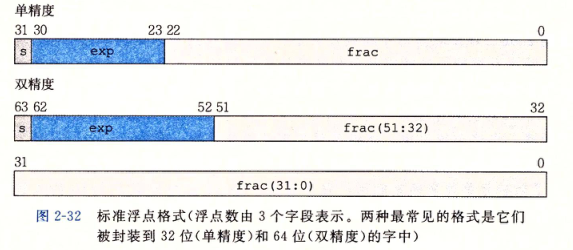

# 1.1 信息在计算机中的表示

在这一章中我们希望直观的向各位展示数据如何在计算机中表示的，同学们可以手动复现一下相关代码。

## 进制

众所周知，计算机以二进制的方式存储数据，二进制中每一位只有0和1两种可能的值，相信各位同学在高中阶段已经了解进制的概念了（关于基数与位权的一些概念，想重温这部分知识推荐阅读《编码:隐匿在计算机软硬件背后的语言》第七、八章）。

大多数计算机使用字节（也就是8位或8bit）为最小的可寻址内存单位，而不是单独的位。

一个字节由八位组成，则它的值域为$$00000000_2\sim11111111_2$$，如果看成十进制值域就是$$0_{10}\sim 255_{10}$$

可以发现用二进制表示数据是很麻烦的，譬如想表示十进制整数$$214_{10}$$至少也需写成$$11100000_2$$，于是我们通常使用十六进制进行表示，十六进制与二进制转换如下表所示。


所以我们通常使用两个十六进制数表示一个字节的信息，取值范围为$$0x00\sim 0xFF$$

在本版块你需要掌握什么？二进制、十进制、十六进制之间的快速相互转换。

## 字节序

计算机以字节为单位，那么对于跨字节的对象就存在字节的存储顺序的规则，主要分为两类，一类是小端序（Little endian），另一类是大端序（Big endian）。

考虑一个多字节的对象$$t = a_na_{n-1}a_{n-2}....a_2a_1a_0$$，$$a_i$$表示某一bit，我们记$$a_0$$为最低有效位，$$a_n$$为最高有效位，由此也可推出最高有效字节为$$a_na_{n-1}a_{n-2}a_{n-3}a_{n-4}a_{n-5}a_{n-6}a_{n-7}$$，最低有效字节为$$a_7a_6a_5a_4a_3a_2a_1a_0$$。

我们称**按照从最低有效字节到最高有效字节的顺序存储的方式为“小端序”，从最高有效字节到最低有效字节的顺序存储的方式为“大端序”**，整数0x01234567的存储示例如下所示。


你可以通过下面这个示例代码体验这个过程，如你所知的那样char的大小恰好为一个字节，本实验中涉及了一些指针的用法，请查阅教材4.7节相关内容。

```
//byte.cpp
#include<cstdio>
using namespace std;

char a = 'A';
int b = 0x12345678;
char c[] = "abcd";
short d[] = {0x1234,0x5678};

int main(){
	printf("%x\n",a);
    for(int i = 0;i < 4;i++){
        printf("%x ",*((char*)&b+i));
    }
    printf("\n");
    for(int i = 0;i < 4;i++){
        printf("%x ",c[i]);
    }
    printf("\n");
    for(int i = 0;i < 4;i++){
        printf("%x ",*((char*)&d+i));
    }
    printf("\n");
    return 0;
}
```

```
>>> g++ byte.cpp -o byte.out
>>> ./byte.out
41
78 56 34 12 
61 62 63 64 
34 12 78 56 
```

当数据为单一字节是，无论是大端序还是小端序保存，字节的存储都是一样的，对于多字节数据，大端序和小端序的会导致不同存储顺序。而**字符串是存储在字符数组中，数组是连续存储的，所以在字符数组无论是按照大端序还是小端序存储，存储的结果是一致的**。

除了上述实验的方法验证大端序和小端序，使用十六进制查看器也可以验证，但是我们将“在十六进制查看器打开文件”这一节具体介绍该方法。

在CSAPP中给出了一个鲁棒性更好的打印程序对象字节表示的代码，你可以根据该代码设计代码探索其他类型数据在计算机中的存储。

```
typedef unsigned char *byte_pointer;

void show_bytes(byte_pointer start, size_t len){
	size_t i;
	for(int i = 0;i < len; i++)
		printf("%.2x", start[i]);
	printf("\n");
}

void show_int(int x){
    show_bytes((byte_pointer) &x, sizeof(int));
}
```

## C/C++中的一些运算

> 本节以及下一节根据《深入理解计算机系统（第三版）》编写

### 布尔代数

二进制值是计算机编码、存储和操作信息的核心，所以围绕数值0和1的研究已经演化出了丰富的数学知识体系。这起源于1850年前后乔治●布尔(George Boole, 1815- 1864) 的工作，因此也称为布尔代数(Booleanalgebra)。布尔注意到通过将逻辑值TRUE(真)和FALSE(假)编码为二进制值1和0，能够设计出一种代数，以研究逻辑推理的基本原则。

**布尔代数在二元集合{0,1}上定义，定义了与(AND)、或(OR)、非(NOT)、和异或(EXCLLUSIVE-OR)几种运算**，运算规则如下表所示（二进制0和1表示逻辑值True和False）。


布尔运算应用于最早应用于命题逻辑，与运算中当两个逻辑值同时为真时结果为真；或运算中两个逻辑值至少有一个为真时结果为真；非运算是单目运算操作数为真则结果为假，操作数为假则结果为真；异或运算中两个逻辑值相同则结果为假，两个逻辑值不同则结果为真。

更多知识见离散数学或数字逻辑相关教材。

后来创立信息论领域的ClaudeShannon(1916--2001)首先建立了布尔代数和数字逻辑之间的联系。他在1937年的硕士论文中表明了布尔代数可以用来设计和分析机电继电器网络。尽管那时计算机技术已经取得了相当的发展，但是布尔代数仍然在数字系统的设计和分析中扮演着重要的角色。

现在我们将以上四个布尔运算拓展到位向量的运算，**位向量就是固定长度为w，由0和1组成的串**，位向量的运算定义为串中对应位置预算之间的运算。

假设a和b分别表示位运算$$[a_{w-1},a_{w-2},...,a_0]$$和$$[b_{w-1},b_{w-2},...,b_0]$$。

我们将$$a\&b$$定义为一个长度为$$w$$的位向量，其中第i个元素等于$$a_i\&b_i$$,以此类推。

假设$$a=[0110],b=[1100]$$，则有

$$a\&b=[0100]\\a|b=[1110]\\ \lnot a= [1001]\\a \oplus b =[1010]$$

### 位运算

C/C++语言的一个很有用的特性就是它支持按位布尔运算。事实上，我们在布尔运算中使用的那些符号就是C语言所使用的：|就是OR(或)，&就是AND(与)，\~就是NOT(取反)，而^就是EXCLUSIVE-OR(异或)。这些运算能运用到任何“整型”的数据类型上。

```
#include<cstdio>

int main(){
	using namespace std;
	int a = 0x41,b = 0x55;
	
    printf("a and b = %x\n a or b = %x\n ~a = %x\n a xor b = %x",a&b,a|b,~a,a^b);
    
    return 0;
}

/*控制台输出
a and b = 41
a or b = 55
~a = ffffffbe
a xor b = 14
*/
```

位级运算的一个常见用法就是实现掩码运算，这里掩码是一个位模式，表示从一个字中选出的位的集合。让我们来看一个例子，掩码0xFF(最低的8位为1)表示一个字的低位字节。位级运算x\&OxFF生成一个由x的最低有效字节组成的值，而其他的字节就被置为0。比如，对于x= 0x89ABCDEF, 其表达式将得到0x00000EF。表达式\~0将生成一个全1的掩码，不管机器的字大小是多少。尽管对于一个32位机器来说，同样的掩码可以写成0xFFFFFFF，但是这样的代码不是可移植的。

### 逻辑运算

C/C++提供了一组逻辑运算符||，&&，!，分别对应于命题逻辑中的OR，AND，NOT运算。

注意，**逻辑运算于位运算是不同的**，逻辑运算的**结果只有TRUE(1)或FALSE(0)**。

| 表达式          | 结果   |
| ------------ | ---- |
| !0x41        | 0x00 |
| !0x00        | 0x01 |
| !!0x41       | 0x01 |
| 0x64&&0x55   | 0x01 |
| 0x64\|\|0x55 | 0x01 |

逻辑运算符8.&和II与它们对应的位级运算&和|之间第二个重要的区别是，**惰性求值，如果对** **第一个参数求值就能确定表达式的结果，那么逻辑运算符就不会对第二个参数求值**。因此， 例如，当a=0时表达式a&&5/a将不会造成被零除，而表达式p&&\*p++也不会导致间接引用空指针。

### 移位运算

C/C++语言还提供了一组移位运算，向左或者向右移动位模式。对于一个位表示为$$[a_{w-1},a_{w-2},...,a_0]$$的操作数x，表达式x<\<k会生成一个值，其位表示为$$[a_{w-k-1},a_{w-k-2},...，0,0]$$。也就是说，x向左移动k位，丢弃最高的k位，并在右端补k个0。移位量应该是一个0\~w-1之间的值。移位运算是从左至右可结合的，所以x<\<j<\<k等价于(x<\<j)<\<k。 有一个相应的右移运算x>>k， 但是它的行为有点微妙。一般而言，机器支持两种形式的右移:逻辑右移和算术右移。逻辑右移在左端补k个0，得到的结果是\[0，.，0,工w-1，xu-2，.. xn]。算术右移是在左端补k个最高有效位的值，得到的结果是\[xw-1, ...xw-1，xw-1, xw-2, .，. x]。这种做法看上去可能有点奇特，但是我们会发现它对有符号整数数据的运算非常有用。 让我们来看一个例子，下面的表给出了对一个8位参数x的两个不同的值做不同的移 位操作得到的结果:

| 操作         | 值                               |
| ---------- | ------------------------------- |
| x          | \[01100011] \[10010101]         |
| x << 4     | \[0011\_0000\_] \[0101\_0000\_] |
| x >> 4(逻辑) | \[\_0000\_0110] \[\_0000\_1001] |
| x >> 4(算数) | \[\_0000\_0110] \[\_1111\_1001] |

斜体的数字表示的是最右端(左移)或最左端(右移)填充的值。可以看到除了一个条目之外，其他的都包含填充0。唯一的例外是算术右移\[10010101]的情况。因为操作数的最高位是1，填充的值就是1。

C语言标准并没有明确定义对于有符号数应该使用哪种类型的右移——算术右移或逻辑右移都可以。不幸地，这就意味着任何假设一种或者另一种右移形式的代码都可能会遇到可移植性问题。然而，实际上，几乎所有的[编译器](1.2-cong-c++-dai-ma-dao-er-jin-zhi-cheng-xu.md)都对有符号数使用算术右移，且许多程序员也都假设机器会使用这种右移。另一方面，对于无符号数，右移必须是逻辑的。

## 整数的表示

C/C++中存在char、short、int、long等数据类型用于表示整数，同时还可以使用`unsigned`来指明是非负数（不使用该关键词则默认为可能为负数）。

C语言标准只规定了每种数据类型必须能表示的最小取值范围，因此导致long类型整数的范围在32位机器字长的机器和64位机器字长的机器上是不同的，出于程序可以移植性和兼容性的考虑，C/C++中引入了固长度的数据类型：`int32_t`、`uint32_t`、`int64_t`、`uint64_t`。

### 无符号数的编码

假设有一个整数数据类型有w位。我们可以将位向量写成$\vec x$，表示整个向量，或者写 成$\[x\_{w-1}, x\_{w-2},..., x\_0]$，表示向量中的每一位。把$\vec x$看做一一个二进制表示的数，就获得$\vec x$的无符号表示。在这个编码中，每个位$x\_i$都取值为0或1，后一种取值意味着数值$2^i$应 为数字值的一部分。我们用一个函数$B2U\_w$(Binary to Unsigned的缩写，长度为w)来表示。

$无符号数编码的定义，对向量\vec{x}=\[x\_{w-1}, x\_{w-2},..., x\_0]:\B2U\_w(\vec{x})=\sum\limits\_{i=0}^{w-1} x\_i2^i$

易证函数B2U\_w是一个双射，即无符号编码具有唯一性，对于每一个向量长度位w的$\vec{x}$有唯一的数值$y$与之对应，同样对于每一个数值在$0\sim2^{w}-1$之间的y都有唯一的长度为w向量与之对应，我们称之为$U2B\_w$。

### 有符号数的表示

对于许多应用，我们还希望表示负数值。最常见的有符号数的计算机表示方式就是补 码( two' s-complement)形式。在这个定义中，将字的最高有效位解释为负权( negative weight)。我们用函数$B2T\_w$(Binary to Two' s-complement的缩写，长度为w)来表示。

$补码编码的定义，对向量\vec{x}=\[x\_{w-1}, x\_{w-2},..., x\_0]:\B2T\_w(\vec{x})=-x\_{w-1}2^{w-1}+\sum\limits\_{i=0}^{w-2} x\_i2^i$

最高有效位$x\_{w-1}$也称为符号位，它的“权重”为$-2^{w-1}$, 是无符号表示中权重的负 数。符号位被设置为1时，表示值为负，而当设置为0时，值为非负。

我们可以看出$B2T\_w$是一个从长度为w的位模式到$TMin\_w$和$TMax\_w$之间数字的映射，写作$B2T: {0，1}^{w}→{TMin\_w,...TMax\_w}$。同无符号表示一样，在可表示的取值范围内的每个数字都有一个唯一的w位的补码编码。这就导出了与无符号数相似的补码编码的唯一性.函数$B2T\_w$。是一个双射。我们定义函数$T2B\_w$(即“补码到二进制”)作为$B2T\_w$的反函数。也就是说，对于每个数x，满足$TMin\_w≤x≤TMax——w$，则$T2B\_w(x)$是x唯一的w位模式。

### 补码与无符号数的转换

由上面可知对满足$TMin\_w≤x≤TMax\_w$的x有:$T2U\_w(x) =\begin{cases} \&x+2^w\&x<0,\\\&x\&x≥0,\end{cases}$

由上面可知对满足$0≤u≤UMax\_w$的u有:$U2T\_w(u) =\begin{cases} \&u\&x<=Tmax\_w,\\&-2^w+u\&u>Tmax\_w,\end{cases}$

### C/C++语言中的整数类型转换

#### 有符号和无符号类型转换

C/C++允许无符号数和有符号数之间转换。

```
//显式的强制转换
int tx,ty;
usigned int ux,uy;
tx = (int) ux;
uy = (unsigned int) ty;
```

```
//隐式转换
int tx,ty;
usigned int ux,uy;
tx = ux;
uy = ty;
```

```
//printf没有任何类型信息但可以通过指示符规定输出类型
int x = -1;
unsigned int u =2147483648;
printf("x = %u = %d\n",x,x);
printf("u = %u = %d\n"u,u);
/*
当在一个32位机器上运行时，它的输出如下:
x = 4294967295 = -1
u = 2147483648 = -2147483648
*/
```

另外，当执行-一个运算时，如果它的一个运算数是有符号的而另一个是无符号的，那么C/C++语言会隐式地将有符号参数强制类型转换为无符号数，并假设这两个数都是非负的，来执行这个运算。

#### 位扩展

从一个字长较小的数据类型转换到字长较大的数据类型时，会产生位拓展的问题。

1. 无符号拓展

**要将一个无符号数转换为一个更大的数据类型，我们只要简单地在表示的开头添加0。**

1. 有符号拓展

**要将一个补码数字转换为一个更大的数据类型，可以执行-一个符号扩展(sign extension) ，在表示中添加最高有效位的值**

#### 整数截断

从一个字长较大的数据类型转换到字长较小的数据类型时，会产生截断的问题。

当将一个w位的数$\vec{x}=\[x\_{w-1}, x\_{w-2},..., x\_0]$截断为一个k位数字时，我们会丢弃高w-k位，得到一个位向量$\vec{x}=\[x\_{k-1}, x\_{k-2},..., x\_0]$。截断一个数字可能会改变它的值——溢出的一种形式。由此可得：

1. 无符号截断

$B2U\_w(\[x\_{w-1},x\_{w-2},...,x\_0]) mod\ 2^k = B2U\_k(\[x\_{k-1},x\_{k-2},...,x\_0])$

截断为k为即对$2^k$。

1. 有符号拓展

$B2T\_k(\[x\_{k-1},x\_{k-2},...,x\_0]) = U2T\_w(B2U\_w(\[x\_{w-1},x\_{w-2},...,x\_0]\ mod\ 2^k)$

截断为k位，先作为无符号数截断在转为有符号数。

## 浮点数的表示

### 二进制小数

理解浮点数的第一步是考虑含有小数值的二进制数字。首先，让我们来看看更熟悉的十进制表示法。十进制表示法使用如下形式的表示:

$d\_md\_{m-1}...d\_1d\_0.d\_{-1}d\_{-2}...d\_{-n}$

其中每个十进制数$d\_i$的取值范围是0\~9。这个表达描述的数值d定义如下:

$d=\sum\limits^{m}\_{i=-n}10^i \*d\_i$

数字权的定义与十进制小数点符号(‘. ')相关，这意味着小数点左边的数字的权是10的正幂，得到整数值，而小数点右边的数字的权是10的负幂，得到小数值。

由此我们可以推出二进制小数表达$b=\sum\limits^{m}\_{i=-n}2^i _b\_i$，如$101.11\_2=1_2^2+0_2^{1}+1_2^{0}+1_2^{-1}+1_2^{-2}=5.75$

你一定注意到了这里存在精度的问题，**有些实数是二进制浮点数无法表示的**，譬如1/3，这常常引发一些错误，请读者注意。

### IEEE浮点数

接下来具体谈一谈被广泛采用的IEEE浮点表示

IEEE浮点标准用$V=(-1)^s\* M\*2^E$的形式来表示一个数:

* 符号(sign) s决定这数是负数(s=1)还是正数(s=0)，而对于数值0的符号位解释作为特殊情况处理。
* 尾数(significand) M是一个二进制小数，它的范围是$1\sim2-\epsilon$，或者是$0\sim1-\epsilon$。
* 阶码(exponent) E 的作用是对浮点数加权，这个权重是2的E次幂\*\*(可能是负数)\*\*。

将浮点数的位表示划分为三个字段，分别对这些值进行编码:

* 一个单独的符号位s直接编码符号s。
* k位的阶码字段$exp=e\_{k-1}...e\_{1}e\_0$编码阶码E。
* n位小数字段$ftac=f\_{n-1}...f\_{1}f\_0$编码尾数M，但是编码出来的值也依赖于阶码字段的值是否等于0。

图2-32给出了将这三个字段装进字中两种最常见的格式。在单精度浮点格式(C/C++语言中的float)中，s、exp和frac字段分别为1位、k=8位和n=23位，得到一个32位的表示。在双精度浮点格式(C/C++语言中的double)中，s、exp和frac字段分别为1位、k=11位和n=52位，得到一个64位的表示。



给定位表示，根据exp的值，被编码的值可以分成三种不同的情况(最后一种情况有两个变种)。

情况1:规格化的值 这是最普遍的情况。**当exp的位模式既不全为0(数值0)，也不全为1**(单精度数值为255，双精度数值为2047)时，都属于这类情况。在这种情况中，阶码字段被解释为以偏置(biased)形式表示的有符号整数。也就是说，阶码的值是E=e- Bias,其中e是无符号数，其位表示为$e\_{k-1}...e\_1e\_0$，而Bias是一个等于$2^{k-1}-1$(单精度是127，双精度是1023)的偏置值。由此产生指数的取值范围，对于单精度是一126\~+127，而对于双精度是一1022\~1023。

小数字段frac被解释为描述小数值f，其中\$$0≤f<1\$$，其二进制表示为$f\_{n-1}...f\_1f\_0$,也就是二进制小数点在最高有效位的左边。尾数定义为$M=1+f$.有时，这种方式也叫做**隐含的以1开头的**(implied leading 1)表示，因为我们可以把M看成一个二进制表达式为$1.f\_{n-1}f{n-2}...f\_{0}$。的数字。既然我们总是能够调整阶码E,使得尾数M在范围$1≤M<2$之中(假设没有溢出)，那么这种表示方法是一-种轻松获得一个额外精度位的技巧。既然第一位总是等于1，那么我们就不需要显式地表示它。

情况2:非规格化的值 \*\*当阶码域为全0时，所表示的数是非规格化形式。\*\*在这种情况下，阶码值是$E=1-Bias$，而尾数的值是$M=f$,也就是小数字段的值，不包含隐含的开头的1。

非规格化数有两个用途。首先，它们提供了一种表示数值0的方法，因为使用规格化数，我们必须总是使M≥1，因此我们就不能表示0。实际上，**+0.0 的浮点表示的位模式为全0**：符号位是0，阶码字段全为0(表明是一个非规格化值)，而小数域也全为0，这就得到M=f=0。令人奇怪的是，**当符号位为1， 而其他域全为0时，我们得到值一0.0**。根据EEE的浮点格式，**值+0.0和一0.0在某些方面被认为是不同的**，而在其他方面是相同的。非规格化数的另外一个功能是表示那些非常接近于0.0的数。它们提供了一种属性，称为逐渐溢出(gradual underflow),其中，可能的数值分布均匀地接近于0.0。

情况3:特殊值 最后一类数值是当指**阶码全为1的时候出现的。当小数域全为0时，得到的值表示无穷**，当s=0时是$+\infin$，或者当s=1时是$-\infin$。当我们把两个非常大的数相乘，或者除以零时，无穷能够表示溢出的结果。当小数域为非零时，结果值被称为“NaN"， 即“不是一个数(Not a Number)”的缩写。一些运算的结果不能是实数或无穷，就会返回这样的NaN值，比如当计算$\sqrt{-1}$或$\infin-\infin$时。在某些应用中，表示未初始化的数据时，它们也很有用处。

## 溢出问题初探


## 文本的编码

> 所有计算机外部的数据类型的数据采用统一的数据表示法转换后存入计算机中，当数据从计算机输出再还原回来，这种通用的格式称之为位模式。
>
> 位(bit, binary digit的缩写)是存储在计算机中的最小单位;它是0或1。位代表设备的某一状态，这些设备只能处于两种状态之-一。例如，开关要么合上要么断开。用1表示合上状态，0表示断开状态。电子开关就表示一个位。换句话说，一个开关能存储一个位的信息。 今天，计算机使用各种各样的双态设备来存储数据。&#x20;
>
> 为了表示数据的不同类型，应该使用位模式，它是一个序列，有时也被称为位流。它是0和1的组合。我们可以规定某一位模式在某种数据格式下对应某种数据，例如在无符号整数的表示中我们恰好规定位模式与其数值一一对应。

不同的位模式集合被设计用来表示文本符号，其中每个集合我们称之为字符集，表示符合的过程称之为编码，由解释位模式的过程被称之为解码。我们介绍一些常用的字符集：

**1.ASCII**

****

**2.unicode**

****

**3.UTF-8**

****

**4.gbk2312**


## 在十六进制查看器打开文件

为了方便同学们动手实践，我们使用了一款基于网页的十六进制编辑器[HexEd.it](https://hexed.it/)，感谢Jens Duttjke开发了这样有用的工具，并感谢以及提供汉化的志愿者们。

这里我们把文件分为文本文件和其他文件。

### 文本文件

首先我们用记事本编写一个文本文件。


我们用HexEd打开它看一看。


可以看到是我们输入的文字所对应的ASCII码。你一定想到了，文本文件的存储方式就是存储字符的编码。如果输入的是汉字，那你会看到什么呢？动手试一试。

### 图片文件

这里我们再打开了一个png文件（实际上就是本章在进制一节所使用的图），你可以随意找到一些png图片打开，它们大致都是这个样子的。


在上图中，我用红色标出了两个位置，一个是PNG，一个是IHDR，前者是这个文件的一个文件头部标识，对于一个PNG文件来说，其文件头总是由`89504e470d0a1a0a`这样固定的字节来开始的，其中第一个字节0x89超出了ASCII字符的范围，这是为了避免某些软件将PNG文件当做文本文件来处理；后者其实是数据块开始的标识，表示后面是一个IHDR块。当你看到文件的末尾时，你也能看到`IEND`这是PNG文件的结束标志。

PNG图片的一般结构如下：


事实上除文本文件（或叫ASCII文件）都是采取类似的模式，即一个一个块构成。在文件的第一个数据块中会提供对该文件的一些描述，对于PNG图片而言包含图片的长宽、颜色模式等等，在[便携式网络图形 (PNG) 规范](http://www.libpng.org/pub/png/spec/)中你可以了解更多。

### 总结

计算机中的文件是以二进制存储的，它们通常具有一定的格式，这种格式便于程序对文件进行读写。

请读者探索一下问题：

1. 比较zip压缩文件和.docx文档文件
2. 尝试在十六进制编辑器中修改png图片的高和宽，看一看会发生什么。
3. 尝试在文件结尾加上一些数据，看看会怎么样，想一想为什么。


在本节我们将介绍一些关于计算机中的编码知识，在与计算机打交道的过程中难免会遇到各种与编码相关的问题，希望我们所介绍的知识能帮助你对计算机中的编码问题有所认识从而排查出所遇到的问题。

